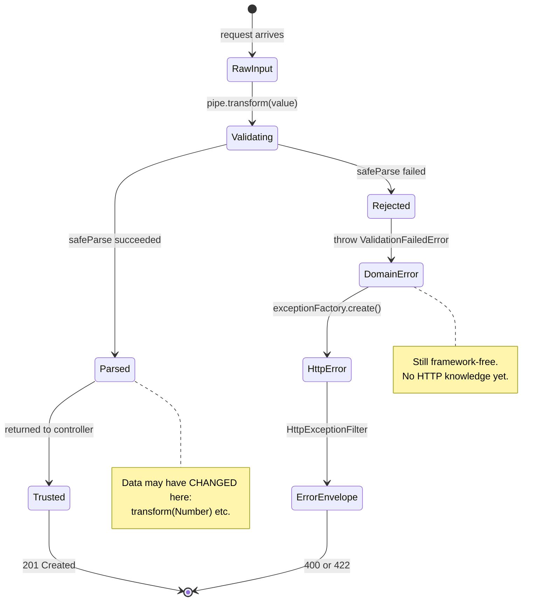
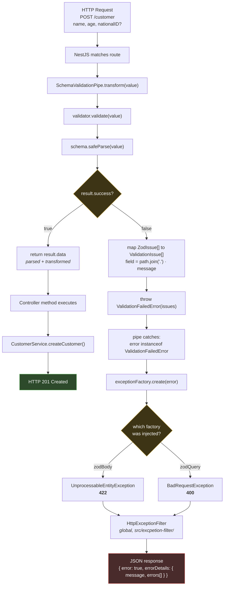

# Validation Module

A framework-agnostic validation layer for NestJS. It validates incoming request data
(body, query, route params), and turns failures into consistent HTTP error responses.

The module is built so that **the validation library is a plug-in detail**. Swapping Zod
for Joi, or adding a second library alongside it, requires adding files — not editing
existing ones.

---

## Table of Contents

1. [State Diagram](#state-diagram)
2. [Flowchart: Request Lifecycle](#flowchart-request-lifecycle)
3. [How the Two Diagrams Fit Together](#how-the-two-diagrams-fit-together)
4. [Folder Responsibilities](#folder-responsibilities)
5. [The Building Blocks](#the-building-blocks)
6. [Usage](#usage)
7. [Extending the Module](#extending-the-module)
8. [SOLID Principles Applied](#solid-principles-applied)
9. [Design Patterns Used](#design-patterns-used)

---

## State Diagram

The lifecycle of a single payload — every state it can occupy, and what moves it on.



### Reading the Diagram

A rounded box is a **state** — a condition the data rests in. An arrow is a
**transition**, and its label is the **trigger** that causes it. The filled circles mark
the start and end of the lifecycle.

**There is no arrow back into `Validating`.** Once data leaves that state it is never
re-checked. Nothing downstream re-validates, which is exactly why the controller can
trust what it receives — and also why a mistake in the schema cannot be caught later.

**`Parsed` and `RawInput` are not the same data.** The note marks where
`transform(Number)` and friends run. A payload that entered as `"12345678901234"`
(a string) leaves as a number. The state diagram makes that mutation an explicit change
of state rather than a hidden side effect.

**The failure path has three distinct states, not one.** `DomainError` → `HttpError` →
`ErrorEnvelope`. Each is owned by a different class, and each knows less about HTTP than
the next. Collapsing them into one state would be the same as hard-coding the response
format inside the validator.

**Both terminal arrows lead to the same `[*]`.** Every request ends — there is no state
the data can get stuck in, and no path that silently drops it.

---

## Flowchart: Request Lifecycle



### Reading the Diagram

**There are exactly two exits.** Either the data is valid and the controller runs
(green), or it is invalid and a structured JSON error comes back (red). The controller
body is never reached with invalid data — validation happens *before* the method is
called, which is why controller code can trust its input without defensive checks.

**Two decision points, two different kinds of decision.** The first diamond
(`result.success?`) is a *runtime* question about the data. The second diamond
(`which factory was injected?`) was already answered at *startup*, when `zodBody()` or
`zodQuery()` constructed the pipe. Nothing inspects the request to pick a status code —
the choice is baked into which preset the route used. That is the Strategy pattern
doing its job.

**The mapping step is where library coupling stops.** The box
`map ZodIssue[] to ValidationIssue[]` is the last point at which Zod-specific shapes
exist. After it, everything downstream — the error class, the factories, the filter,
the JSON response — works with our own `ValidationIssue` type. Replace Zod with Joi and
only this one box changes; every box after it is untouched.

**All failures are collected, not just the first.** `safeParse` reports every issue in
one pass, so a request with three bad fields returns three entries in `errors[]` rather
than forcing three round-trips.

**Two error-handling layers, not one.** The pipe converts a *domain* error
(`ValidationFailedError`) into an *HTTP* error (`HttpException`). The global
`HttpExceptionFilter` then converts that into the final response envelope. Keeping
these separate means the validation code never hard-codes the response format.

---

## How the Two Diagrams Fit Together

Same request, two questions. Each drawing is silent about what the other explains.

| Diagram | Answers | Cannot show | Reach for it when… |
| --- | --- | --- | --- |
| **State** | What does the data *become*? | Who performs each transition. | You are asking whether data was mutated, or where it can get stuck. |
| **Flowchart** | What runs, in what order, where does it branch? | That the data itself changed along the way. | You are debugging one specific request. |

### Where they disagree — and why that is useful

**The flowchart shows `return parsed data` as a single quiet box.** The state diagram
insists it is a genuine change of state, with a note attached. Same line of code, two
levels of alarm — and the state diagram is the one telling the truth: a `nationalID` that
arrived as the string `"123456789012345"` leaves as a number.

**The flowchart's failure path looks like plumbing.** Boxes flow from `throw` to
`exceptionFactory.create` to `HttpExceptionFilter` as if they were routine steps. The
state diagram reframes exactly those steps as three *distinct states* — `DomainError`,
`HttpError`, `ErrorEnvelope` — each knowing less about HTTP than the next. What looks
like plumbing is actually the module's central design decision.

**The flowchart can show a dead end; the state diagram cannot hide one.** Because every
state must lead somewhere, the state diagram is the faster way to check that no request
can get stuck. Both terminal arrows reach `[*]`, so every request ends.

---

## Folder Responsibilities

| Folder | Responsibility | You edit it when… |
| --- | --- | --- |
| `contracts/` | Defines the interfaces everything else agrees on. Contains **no implementation**. | The contract itself needs a new capability. |
| `errors/` | `ValidationFailedError` + `ValidationIssue`. Pure domain — no HTTP, no NestJS, no Zod. | A failure needs to carry new information. |
| `validators/` | Concrete validators that adapt a library to the `Validator` contract. | You add or change a validation library. |
| `exception-factories/` | Translate a domain failure into a specific `HttpException`. One file per status code. | You need a new status code (e.g. 409). |
| `pipes/` | `SchemaValidationPipe` — the NestJS integration point. Orchestrates validator + factory. | Rarely. This is the stable core. |
| `presets/` | Ready-made combinations (`zodBody` = Zod + 422). | You create a combination you use often. |
| `index.ts` | Public entry point for the whole module. | You add a new subfolder. |

---

## The Building Blocks

### `Validator<T>` — the core abstraction

```ts
export interface Validator<T = unknown> {
  validate(value: unknown): T;
}
```

One method. It either returns validated (and possibly transformed) data, or throws
`ValidationFailedError`. It mentions no library by name — that is what makes libraries
swappable.

### `ValidationFailedError` — a domain error

```ts
export interface ValidationIssue {
  field: string;
  message: string;
}

export class ValidationFailedError extends Error {
  constructor(readonly issues: ValidationIssue[]) {
    super('Validation failed');
    this.name = 'ValidationFailedError';
  }
}
```

This error deliberately knows nothing about HTTP. The same validation logic could run in
a CLI command, a queue worker, or a test with no HTTP layer present.

- `super('Validation failed')` sets `.message`, which the factories copy into the
  response body.
- `this.name` is set explicitly because JavaScript does **not** derive `name` from the
  class when you extend `Error` — without it, stack traces read `Error:` instead of
  `ValidationFailedError:`. This is a debugging convenience; it is not used for control
  flow (the pipe uses `instanceof`).

### `ZodValidator` — an Adapter

```ts
export class ZodValidator<T> implements Validator<T> {
  constructor(private readonly schema: ZodSchema<T>) {}

  validate(value: unknown): T {
    const result = this.schema.safeParse(value);
    if (result.success) return result.data;

    throw new ValidationFailedError(
      result.error.issues.map((issue) => ({
        field: issue.path.join('.'),
        message: issue.message,
      })),
    );
  }
}
```

`safeParse` is used instead of `parse` + `try/catch` so that exceptions are not used for
ordinary control flow.

`issue.path` is an **array**, because a failure may be nested: a bad `city` inside
`address` produces `['address', 'city']`. `.join('.')` renders that as `"address.city"`.
For a top-level field the array has one element, so the result is just `"nationalID"` —
no dot appears.

### `SchemaValidationPipe` — orchestration only

```ts
export class SchemaValidationPipe implements PipeTransform {
  constructor(
    private readonly validator: Validator,
    private readonly exceptionFactory: ValidationExceptionFactory,
  ) {}

  transform(value: unknown) {
    try {
      return this.validator.validate(value);
    } catch (error) {
      if (error instanceof ValidationFailedError) {
        throw this.exceptionFactory.create(error);
      }
      throw error;
    }
  }
}
```

`exceptionFactory` is **required, with no default**. A default would force this file to
import a concrete factory class, which would make the high-level pipe depend on a
low-level detail. Supplying defaults is the job of `presets/`.

Unrecognised errors are re-thrown untouched, so genuine bugs surface as 500s instead of
being disguised as validation failures.

---

## Usage

### Request body — responds 422 on failure

```ts
import { zodBody } from '../common/validation';

@Post()
@UsePipes(zodBody(createCustomerSchema))
createCustomer(@Body() body: CustomerDTO) {
  return this.customer.createCustomer(body);
}
```

### Query parameters — responds 400 on failure

```ts
const searchSchema = z.object({
  name: z.string().optional(),
  age: z.string().regex(/^\d+$/).transform(Number).optional(),
});

@Get()
search(@Query(zodQuery(searchSchema)) query: z.infer<typeof searchSchema>) {
  return this.customer.search(query);
}
```

### Route parameters

```ts
const idParamSchema = z.object({
  id: z.string().regex(/^\d+$/, 'id must be numeric').transform(Number),
});

@Get(':id')
getOne(@Param(zodQuery(idParamSchema)) params: z.infer<typeof idParamSchema>) {
  return this.customer.getOne(params.id);
}
```

### Rule of thumb for schema shape

- Decorator **names a field** — `@Query('limit', …)`, `@Param('id', …)` — the pipe
  receives a single value, so use a scalar schema: `z.string()…`.
- Decorator **names nothing** — `@Body()`, `@Query()`, `@Param()` — the pipe receives the
  whole object, so use `z.object({ … })`.

### Example error response

```json
{
  "error": true,
  "errorDetails": {
    "message": "Validation failed",
    "errors": [
      { "field": "nationalID", "message": "nationalID must be exactly 15 digits" },
      { "field": "name", "message": "Invalid input: expected string, received number" },
      { "field": "age", "message": "Invalid input: expected number, received string" }
    ]
  }
}
```

> When an **object** is passed to a NestJS exception it is used verbatim, so no
> `statusCode` key appears inside `errorDetails`. Passing a **string** would make NestJS
> build the envelope itself and add `statusCode` / `error`. The HTTP status on the
> response itself is correct either way.

---

## Extending the Module

### Add a second validation library

**1.** Add one file under `validators/`:

```ts
// validators/joi.validator.ts
import { Schema } from 'joi';
import { Validator } from '../contracts';
import { ValidationFailedError } from '../errors';

export class JoiValidator<T> implements Validator<T> {
  constructor(private readonly schema: Schema<T>) {}

  validate(value: unknown): T {
    const result = this.schema.validate(value, { abortEarly: false });
    if (!result.error) return result.value as T;

    throw new ValidationFailedError(
      result.error.details.map((detail) => ({
        field: detail.path.join('.'),
        message: detail.message,
      })),
    );
  }
}
```

`abortEarly: false` matters — without it Joi stops at the first error and you lose the
"report every problem at once" behaviour.

**2.** Export it from `validators/index.ts`.

**3.** Add matching presets in `presets/joi.presets.ts` (`joiBody`, `joiQuery`) and export
them from `presets/index.ts`.

Both libraries now coexist; different routes can use different ones.

### Add a new status code

Add one file to `exception-factories/`:

```ts
export class ConflictValidationExceptionFactory
  implements ValidationExceptionFactory
{
  create(error: ValidationFailedError): HttpException {
    return new ConflictException({
      message: error.message,
      errors: error.issues,
    });
  }
}
```

Export it, then use it directly: `new SchemaValidationPipe(new ZodValidator(s), new ConflictValidationExceptionFactory())`.

### What does **not** change when you swap libraries

| File | Lines changed |
| --- | --- |
| `contracts/validator.interface.ts` | 0 |
| `contracts/validation-exception-factory.interface.ts` | 0 |
| `errors/validation-failed.error.ts` | 0 |
| `exception-factories/bad-request.exception-factory.ts` | 0 |
| `exception-factories/unprocessable-entity.exception-factory.ts` | 0 |
| `pipes/schema-validation.pipe.ts` | 0 |
| `src/excpetion-filter/http-excpection.filter.ts` | 0 |

The JSON error contract stays byte-for-byte identical, so API clients notice nothing.

### What *does* change — unavoidably

Two things no architecture can protect you from:

1. **The schemas themselves** must be rewritten in the new library's syntax.
2. **Type inference is lost** if you leave Zod. `z.infer<typeof schema>` derives the
   TypeScript type from the schema automatically; Joi has no equivalent, so DTO types
   must be hand-written and kept in sync manually.

---

## SOLID Principles Applied

| Principle | How this module applies it |
| --- | --- |
| **S** — Single Responsibility | `ZodValidator` validates. Factories translate failures to HTTP. The pipe orchestrates. Three reasons to change live in three classes. |
| **O** — Open/Closed | A new library or status code is a **new file**. No existing file is modified. |
| **L** — Liskov Substitution | Any `Validator` can replace any other `Validator`; the pipe cannot tell the difference. |
| **I** — Interface Segregation | Both interfaces declare exactly one method. No implementer is forced to provide something it does not need. |
| **D** — Dependency Inversion | `SchemaValidationPipe` depends on `Validator` and `ValidationExceptionFactory`, never on Zod or on a concrete exception class. |

---

## Design Patterns Used

| Pattern | Where | Why |
| --- | --- | --- |
| **Adapter** | `ZodValidator` | Wraps a third-party API (`ZodSchema`) so it satisfies our own `Validator` contract. |
| **Strategy** | `ValidationExceptionFactory` implementations | The failure-to-HTTP behaviour is selected by injection rather than by a conditional. |
| **Factory Method** | `create(error)` | Encapsulates which `HttpException` subclass gets constructed. |
| **Facade** | `presets/` | Hides multi-step wiring behind `zodBody(schema)`. |
| **Barrel / Module** | every `index.ts` | Exposes one import path per folder and hides internal file layout. |

---

## A Note on Cost

This module is deliberately more structured than a small project strictly requires:
roughly a dozen files implement what could be written in one. The extra files buy
replaceability, and that only pays off once a second validation library, a second error
format, or non-HTTP consumers actually appear.

If a folder ever feels like pure ceremony, folders can be merged without breaking
anything outside this module — the root `index.ts` hides the internal layout from the
rest of the codebase.
